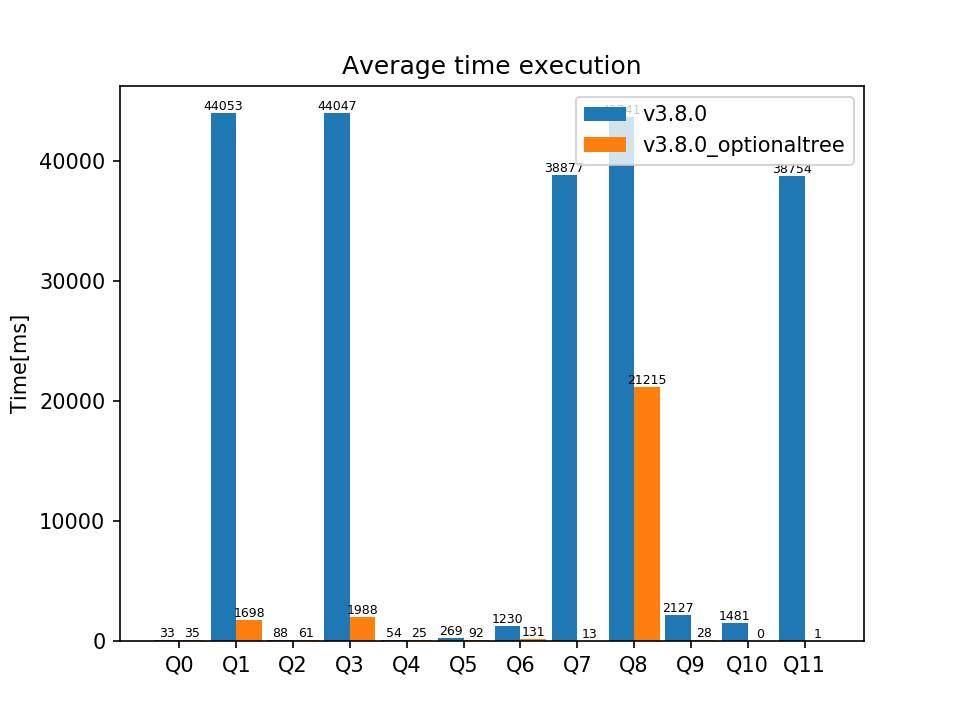

Se usó el leapfrog con el GAO según la herística de dejar primero las variables que aparen en distintas posiciones (s,p,o) y con más repeticiones.

  

## timeouts
* 5 timeouts en la Q7 para la ejecución normal.
* 6 timeouts en la Q8 para la ejecución normal.
* 20 timeouts (siempre) en la Q10 para la ejecución con leapfrog.
  
## Q0:  
SELECT * WHERE {  
	?x ?y ?z .  
}   
LIMIT 10000  
  
## Q1:  
SELECT * WHERE {  
	?x ?y ?z .  
	?z ?y ?x  
}  
LIMIT 10000  
  
## Q2:  
SELECT * WHERE {  
	?x ?y ?z .  
	?x ?u ?z  
}  
LIMIT 10000  
  
## Q3:  
SELECT * WHERE {  
	?x ?y ?z .  
	?z ?y ?u .  
	?u ?y ?z   
}  
LIMIT 10000  
  
## Q4:  
SELECT * WHERE {"  
	?x <<http://data.linkedmdb.org/resource/movie/sequel>> ?y .  
	?y <<http://data.linkedmdb.org/resource/movie/sequel>> ?z .  
	?z <<http://data.linkedmdb.org/resource/movie/sequel>> ?u  
}  
LIMIT 10000  
  
## Q5:  
SELECT * WHERE {  
    ?x <<http://data.linkedmdb.org/resource/oddlinker/link_type>>   ?y1 .  
	?x <<http://data.linkedmdb.org/resource/oddlinker/link_target>> ?y2 .  
	?x <<http://data.linkedmdb.org/resource/oddlinker/linkage_run>> ?y3 .  
	?x <<http://data.linkedmdb.org/resource/oddlinker/link_source>> ?y4  
}  
LIMIT 10000  
  
## Q6:  
SELECT * WHERE {  
    ?x <<http://data.linkedmdb.org/resource/oddlinker/link_source>> ?y .  
	?x <<http://data.linkedmdb.org/resource/oddlinker/link_target>> ?y1 .  
	?x <<http://data.linkedmdb.org/resource/oddlinker/link_type>>   ?y2 .  
	?x <<http://data.linkedmdb.org/resource/movie/linkid>>          ?y3 .  
	?y <<http://dbpedia.org/property/hasPhotoCollection>>           ?z1 .  
	?y <<http://www.w3.org/2000/01/rdf-schema#label>>               ?z2 .  
	?y <<http://www.w3.org/2002/07/owl#sameAs>>                     ?z3  
}  
LIMIT 10000  
  
## Q7:  
SELECT * WHERE {  
    ?x ?y ?z .  
    ?y ?u ?v .  
    ?u ?w ?z  
}  
LIMIT 10000  
  
## Q8:  
SELECT * WHERE {  
	?x ?c ?y.  
	?x ?c ?z.  
	?y ?c ?z.  
	?y ?c ?u.  
	?z ?c ?u.  
	?u ?c ?x  
}  
LIMIT 10000  
  
## Q9:  
SELECT * WHERE {  
	?x <<http://data.linkedmdb.org/resource/movie/sequel>>        ?y .  
	?x <<http://data.linkedmdb.org/resource/movie/performance>>   ?a1 .  
	?x <<http://data.linkedmdb.org/resource/movie/performance>>   ?a2 .  
	?y <<http://data.linkedmdb.org/resource/movie/actor>>         ?z .  
	?y <<http://www.w3.org/2000/01/rdf-schema#label>>             ?a3 .  
	?y <<http://data.linkedmdb.org/resource/movie/performance>>   ?a4 .  
	?z <<http://data.linkedmdb.org/resource/movie/actor_actorid>> ?a5 .  
	?z <<http://www.w3.org/2000/01/rdf-schema#label>>             ?a6 .  
	?z <<http://dbpedia.org/property/hasPhotoCollection>>         ?a7  
}  
LIMIT 10000  
  
## Q10:  
SELECT * WHERE {  
	?x <<http://data.linkedmdb.org/resource/oddlinker/link_source>>    ?y .  
	?x <<http://data.linkedmdb.org/resource/oddlinker/link_source>>    ?z .  
	?x <<http://data.linkedmdb.org/resource/oddlinker/linkage_run>>    ?u .  
	?y <<http://www.w3.org/2000/01/rdf-schema#label>>                  ?a1 .  
	?y <<http://www.w3.org/2000/01/rdf-schema#label>>                  ?a2 .  
	?y <<http://www.w3.org/2002/07/owl#sameAs>>                        ?a3 .  
	?z <<http://www.w3.org/2000/01/rdf-schema#label>>                  ?a4 .  
	?z <<http://www.w3.org/2000/01/rdf-schema#label>>                  ?a5 .  
	?z <<http://www.w3.org/2002/07/owl#sameAs>>                        ?a6 .  
	?u <<http://www.w3.org/1999/02/22-rdf-syntax-ns#type>>             ?a7 .  
	?u <<http://data.linkedmdb.org/resource/oddlinker/linkage_method>> ?a8 .  
	?u <<http://data.linkedmdb.org/resource/oddlinker/linkage_date>>   ?a9  
}  
LIMIT 10000  
  
## Q11:  
SELECT * WHERE {  
	?x ?y ?z .  
	?y ?u ?v .  
	?u ?w ?r .  
	?w ?y ?s  
}  
LIMIT 10000  
  
