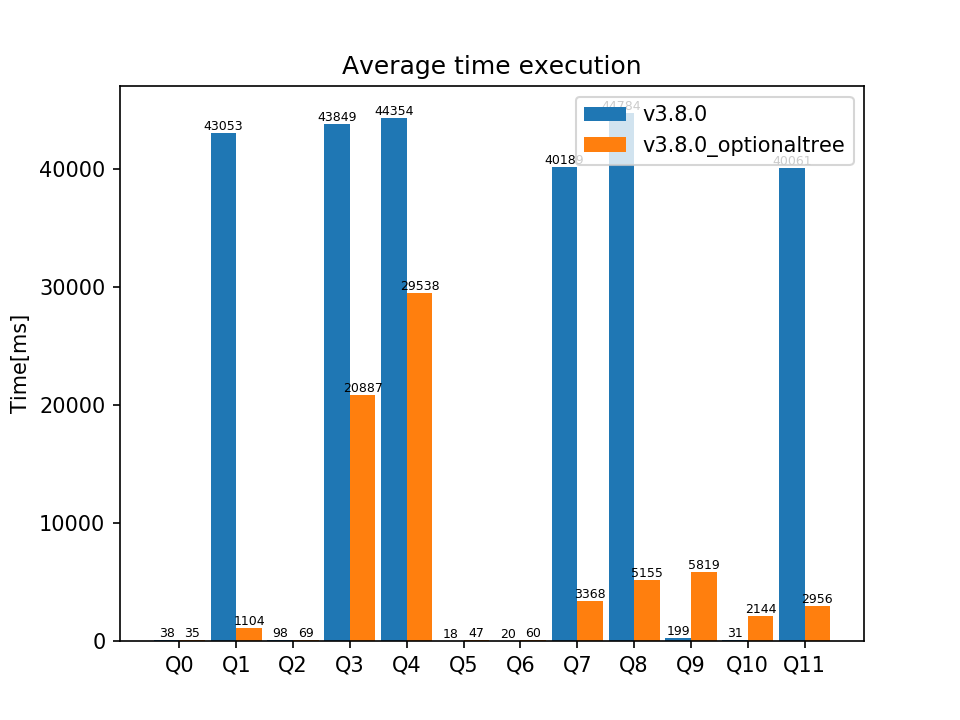

Se usó el leapfrog con el GAO según el orden en que se ve la variable (en cada repeticion se genera una permutación de triples aleatoria).   
  
  

## timeouts
* 5 timeouts en la Q7 para la ejecución normal.
* 6 timeouts en la Q8 para la ejecución normal.
* 3 timeouts en la Q9 para la ejecución con el leapfrog.
* 1 timeouts en la Q10 para la ejecución con el leapfrog.

## Q0:
SELECT * WHERE {    
	?x ?y ?z .  
}   
LIMIT 10000  
  
## Q1:  
SELECT * WHERE {  
	?x ?y ?z .  
	?z ?y ?x  
}  
LIMIT 10000  
  
## Q2:  
SELECT * WHERE {  
	?x ?y ?z .  
	?x ?u ?z  
}  
LIMIT 10000  
  
## Q3:  
SELECT * WHERE {  
	?x ?y ?z .  
	?z ?y ?u .  
	?u ?y ?z   
}  
LIMIT 10000  
  
## Q4:  
SELECT * WHERE {  
	?x ?p ?y .  
	?y ?p ?z .  
	?z ?p ?u  
}  
LIMIT 10000  
  
## Q5:  
SELECT * WHERE {  
    ?x ?p1 ?y1 .  
	?x ?p2 ?y2 .  
	?x ?p3 ?y3 .  
	?x ?p4 ?y4  
}  
LIMIT 10000  
  
## Q6:  
SELECT * WHERE {  
    ?x ?p1 ?y .  
	?x ?p2 ?y1 .  
	?x ?p3 ?y2 .  
	?x ?p4 ?y3 .  
	?y ?p5 ?z1 .  
	?y ?p6 ?z2 .  
	?y ?p7 ?z3  
}  
LIMIT 10000  
  
## Q7:  
SELECT * WHERE {  
    ?x ?y ?z .  
    ?y ?u ?v .  
    ?u ?w ?z  
}  
LIMIT 10000  
  
## Q8:  
SELECT * WHERE {  
	?x ?c ?y.  
	?x ?c ?z.  
	?y ?c ?z.  
	?y ?c ?u.  
	?z ?c ?u.  
	?u ?c ?x  
}  
LIMIT 10000  
  
## Q9:  
SELECT * WHERE {  
	?x ?p1 ?y .  
	?x ?p2 ?a1 .  
	?x ?p2 ?a2 .  
	?y ?p3 ?z .  
	?y ?p4 ?a3 .  
	?y ?p2 ?a4 .  
	?z ?p5 ?a5 .  
	?z ?p6 ?a6 .  
	?z ?p7 ?a7  
}  
LIMIT 10000  
  
## Q10:  
SELECT * WHERE {  
	?x ?p1 ?y .  
	?x ?p1 ?z .  
	?x ?p2 ?u .  
	?y ?p3 ?a1 .  
	?y ?p3 ?a2 .  
	?y ?p4 ?a3 .  
	?z ?p3 ?a4 .  
	?z ?p3 ?a5 .  
	?z ?p4 ?a6 .  
	?u ?p5 ?a7 .  
	?u ?p6 ?a8 .  
	?u ?p7 ?a9  
}  
LIMIT 10000  
  
## Q11:  
SELECT * WHERE {  
	?x ?y ?z .  
	?y ?u ?v .  
	?u ?w ?r .  
	?w ?y ?s  
}  
LIMIT 10000  
