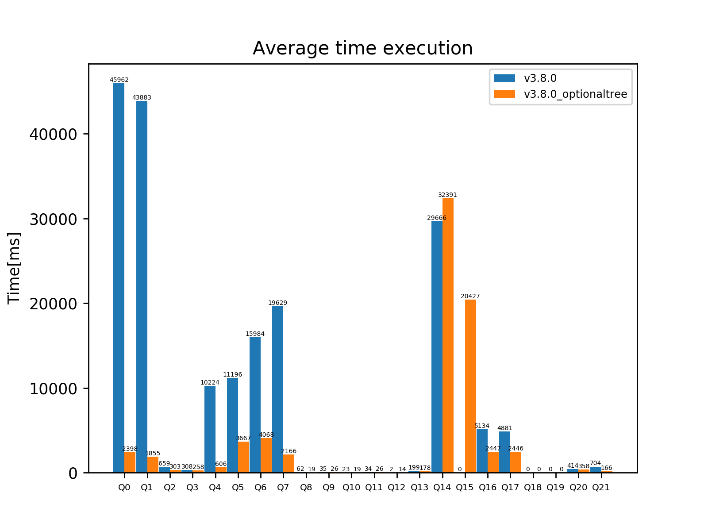

  

## Q1: Query bidireccional
SELECT * WHERE {?x ?y ?z . ?z ?y ?x}

## Q2: Query bidireccional distinta propiedad
SELECT * WHERE {?x ?y ?z . ?z ?y2 ?x}

## Q3: Query bidireccional propiedad fija
SELECT * WHERE {  
  ?x <http://data.linkedmdb.org/resource/movie/director> ?z .  
  ?z ?y2 ?x  
}  
  
## Q4: Query bidireccional ambas propiedades fijas  
SELECT * WHERE {  
  ?x <http://data.linkedmdb.org/resource/movie/director> ?z .  
  ?z <http://xmlns.com/foaf/0.1/made> ?x  
}  
  
## Q5: Doble propiedad  
SELECT * WHERE {  
  ?x <http://www.w3.org/2000/01/rdf-schema#label> ?z .  
  ?x <http://purl.org/dc/terms/title> ?z  
}  
  
## Q6: Árbol 1  
SELECT * WHERE {  
  ?x <http://www.w3.org/1999/02/22-rdf-syntax-ns#type> ?y .  
  ?x <http://www.w3.org/2000/01/rdf-schema#label> ?z  
}  
  
## Q7: Árbol 2  
SELECT * WHERE {  
  ?x <http://www.w3.org/1999/02/22-rdf-syntax-ns#type> ?y .  
  ?x <http://www.w3.org/2000/01/rdf-schema#label> ?z .  
  ?x <http://xmlns.com/foaf/0.1/page> ?u  
}  
  
## Q8: Árbol 3 (puedes seguir probando con propiedades del ranking)  
SELECT * WHERE {  
  ?x <http://www.w3.org/1999/02/22-rdf-syntax-ns#type> ?y .  
  ?x <http://www.w3.org/2000/01/rdf-schema#label> ?z .  
  ?x <http://xmlns.com/foaf/0.1/page> ?u .  
  ?x <http://data.linkedmdb.org/resource/movie/performance> ?v  
}  
  
## Q9: Camino de Sequel 1 (Sólo se arman caminos así con prequel y sequel)  
SELECT * WHERE {  
  ?x <http://data.linkedmdb.org/resource/movie/sequel> ?y .  
  ?y <http://data.linkedmdb.org/resource/movie/sequel> ?z  
}  
  
## Q10: Camino de Sequel 2  
SELECT * WHERE {  
  ?x <http://data.linkedmdb.org/resource/movie/sequel> ?y .  
  ?y <http://data.linkedmdb.org/resource/movie/sequel> ?z .  
  ?z <http://data.linkedmdb.org/resource/movie/sequel> ?v  
}  
  
## Q11: Camino de Prequel 1  
SELECT * WHERE {  
  ?x <http://data.linkedmdb.org/resource/movie/prequel> ?y .  
  ?y <http://data.linkedmdb.org/resource/movie/prequel> ?z  
}  
  
## Q12: Camino de Prequel 2  
SELECT * WHERE {  
  ?x <http://data.linkedmdb.org/resource/movie/prequel> ?y .  
  ?y <http://data.linkedmdb.org/resource/movie/prequel> ?z .  
  ?z <http://data.linkedmdb.org/resource/movie/prequel> ?v  
}  
  
## Q13: Actores a distancia 1 de KB  
SELECT * WHERE {  
  ?mov <http://data.linkedmdb.org/resource/movie/actor> <http://data.linkedmdb.org/resource/actor/29539> .  
  ?mov <http://data.linkedmdb.org/resource/movie/actor> ?act  
}  
  
## Q14: Actores a distancia 2 de KB  
SELECT * WHERE {  
  ?mov <http://data.linkedmdb.org/resource/movie/actor> <http://data.linkedmdb.org/resource/actor/29539> .  
  ?mov <http://data.linkedmdb.org/resource/movie/actor> ?act2 .  
  ?mov2 <http://data.linkedmdb.org/resource/movie/actor> ?act2 .  
  ?mov2 <http://data.linkedmdb.org/resource/movie/actor> ?act  
}  
  
## Q15: Actores a distancia 3 de KB (puedes cambiar de actor y continuar esta idea)  
SELECT * WHERE {  
  ?mov <http://data.linkedmdb.org/resource/movie/actor> <http://data.linkedmdb.org/resource/actor/29539> .  
  ?mov <http://data.linkedmdb.org/resource/movie/actor> ?act3 .  
  ?mov2 <http://data.linkedmdb.org/resource/movie/actor> ?act3 .  
  ?mov2 <http://data.linkedmdb.org/resource/movie/actor> ?act2 .  
  ?mov3 <http://data.linkedmdb.org/resource/movie/actor> ?act2 .  
  ?mov3 <http://data.linkedmdb.org/resource/movie/actor> ?act  
}  
  
## Q16: Triángulos  
SELECT * WHERE {  
  ?x ?p1 ?y .  
  ?x ?p2 ?z .  
  ?y ?p3 ?z  
}  
  
## Q17: Triángulo con una variable  
SELECT * WHERE {  
  ?x <http://data.linkedmdb.org/resource/movie/performance> ?y .  
  ?x <http://data.linkedmdb.org/resource/movie/actor_name> ?z .  
  ?y ?p ?z  
}  

## Q18: Triángulo fijo
SELECT * WHERE {  
  ?x <http://data.linkedmdb.org/resource/movie/performance> ?y .  
  ?x <http://data.linkedmdb.org/resource/movie/actor_name> ?z .  
  ?y <http://data.linkedmdb.org/resource/movie/performance_actor> ?z  
}  
  
## Q19: Rombo (pensar en agregar este filtro FILTER(?x != ?y && ?p1 != ?p2 && ?p3 != ?p4 && ?u != ?v))  
SELECT * WHERE {  
  ?x ?p1 ?u .  
  ?x ?p2 ?v .  
  ?y ?p3 ?u .  
  ?y ?p4 ?v  
}  
  
## Q20: Rombo fijo 1  
SELECT * WHERE {  
  ?x <http://data.linkedmdb.org/resource/oddlinker/linkage_run> ?u .  
  ?x <http://www.w3.org/1999/02/22-rdf-syntax-ns#type> ?v .  
  ?y <http://data.linkedmdb.org/resource/oddlinker/linkage_run> ?u .  
  ?y <http://www.w3.org/1999/02/22-rdf-syntax-ns#type> ?v  
}  
  
## Q21: Rombo fijo 2  
SELECT * WHERE {  
  ?x <http://data.linkedmdb.org/resource/movie/actor_actorid> ?u .  
  ?x <http://www.w3.org/1999/02/22-rdf-syntax-ns#type> ?v .  
  ?y <http://data.linkedmdb.org/resource/movie/director_directorid> ?u .  
  ?y <http://www.w3.org/1999/02/22-rdf-syntax-ns#type> ?v  
}  
  
## Q22: Árbol 4 (consulta de actores que son directores)  
SELECT * WHERE {  
  ?mov <http://data.linkedmdb.org/resource/movie/director> ?dir .  
  ?dir <http://data.linkedmdb.org/resource/movie/director_name> ?x .  
  ?y <http://data.linkedmdb.org/resource/movie/actor_name> ?x .  
}  
