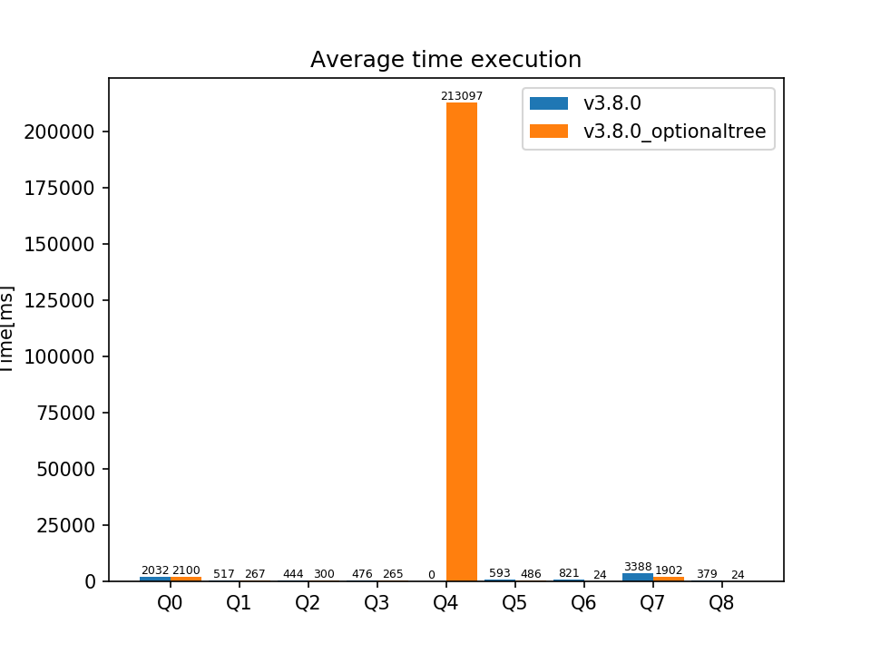

Se usó el leapfrog con el GAO según la herística de dejar primero las variables que aparen en distintas posiciones (s,p,o) y con más repeticiones.

Solo se ejecutaron 10 repeticiones en lugar de las 20 repeticiones usuales porque no hay orden aleatorio de triples

  

## timeouts
10 timeouts (siempre) en la Q4 para la ejecución normal.

## Q0     
SELECT * WHERE {   
    ?x <<http://example.org/p2>> ?x_0 .    
    ?x <<http://example.org/p2>> ?x_1 .    
    ?x <<http://example.org/p2>> ?x_2 .    
    ?x <<http://example.org/p2>> ?x_3 .    
    OPTIONAL {   
        ?x_3 <<http://example.org/p2>> ?x_3_0 .    
        ?x_3 <<http://example.org/p2>> ?x_3_1 .    
        ?x_3 <<http://example.org/p3>> ?x_3_2 .    
    }   
}  
  
  
## Q1  
SELECT * WHERE {   
    ?x <<http://example.org/p2>> ?x_0 .    
    ?x <<http://example.org/p1>> ?x_1 .    
    ?x <<http://example.org/p2>> ?x_2 .    
    ?x <<http://example.org/p1>> ?x_3 .    
    OPTIONAL {   
        ?x_3 <<http://example.org/p3>> ?x_3_d .   
        ?x_3_d <<http://example.org/p3>> ?x_3_d_0 .   
        ?x_3_d <<http://example.org/p3>> ?x_3_d_1 .   
        ?x_3_d <<http://example.org/p2>> ?x_3_d_2 .   
    }  
}  
  
  
## Q2  
SELECT * WHERE {  
    ?x <<http://example.org/p3>> ?x_0 .   
    ?x <<http://example.org/p1>> ?x_1 .    
    ?x <<http://example.org/p3>> ?x_2 .   
    ?x <<http://example.org/p1>> ?x_3 .   
    OPTIONAL {  
        ?x_3 <<http://example.org/p3>> ?x_3_l .  
        ?x_3 <<http://example.org/p1>> ?x_3_r .  
        ?x_3_l <<http://example.org/p3>> ?x_3_r .  
    }   
}  
  
## Q3  
SELECT * WHERE {  
    ?x <<http://example.org/p1>> ?x_0 .    
    ?x <<http://example.org/p3>> ?x_1 .    
    ?x <<http://example.org/p3>> ?x_2 .    
    ?x <<http://example.org/p1>> ?x_3 .    
    ?x <<http://example.org/p2>> ?x_4 .    
    OPTIONAL {   
        ?x_3 <<http://example.org/p3>> ?x_3_0 .    
        ?x_3 <<http://example.org/p2>> ?x_3_1 .    
        ?x_3 <<http://example.org/p1>> ?x_3_2 .    
    } .   
    OPTIONAL {   
        ?x_4 <<http://example.org/p1>> ?x_4_0 .    
        ?x_4 <<http://example.org/p3>> ?x_4_1 .    
        ?x_4 <<http://example.org/p2>> ?x_4_2 .    
    }   
}  
  
## Q4  
SELECT * WHERE {   
    ?x <<http://example.org/p1>> ?x_0 .    
    ?x <<http://example.org/p2>> ?x_1 .    
    ?x <<http://example.org/p3>> ?x_2 .    
    ?x <<http://example.org/p3>> ?x_3 .    
    OPTIONAL {  
        ?x_3 <<http://example.org/p3>> ?x_3_0 .    
        ?x_3 <<http://example.org/p1>> ?x_3_1 .    
        ?x_3 <<http://example.org/p2>> ?x_3_2 .    
    } .   
    OPTIONAL {   
        ?x_4 <<http://example.org/p2>> ?x_4_l .    
        ?x_4 <<http://example.org/p3>> ?x_4_r .    
        ?x_4_l <<http://example.org/p2>> ?x_4_r .    
    }  
}  
  
## Q5  
SELECT * WHERE {   
    ?x <<http://example.org/p3>> ?x_0 .    
    ?x <<http://example.org/p1>> ?x_1 .    
    ?x <<http://example.org/p3>> ?x_2 .    
    ?x <<http://example.org/p1>> ?x_3 .    
    OPTIONAL {   
        ?x_3 <<http://example.org/p2>> ?x_3_0 .    
        ?x_3 <<http://example.org/p2>> ?x_3_1 .    
        ?x_3 <<http://example.org/p2>> ?x_3_2 .    
        OPTIONAL {   
            ?x_3_2 <<http://example.org/p1>> ?x_3_2_l .    
            ?x_3_2 <<http://example.org/p2>> ?x_3_2_r .    
            ?x_3_2_l <<http://example.org/p2>> ?x_3_2_r .    
        }   
    }   
}     
  
## Q6  
SELECT * WHERE {   
    ?x <<http://example.org/p3>> ?x_0 .    
    ?x <<http://example.org/p3>> ?x_1 .    
    ?x <<http://example.org/p3>> ?x_2 .    
    ?x <<http://example.org/p2>> ?x_3 .    
    ?x <<http://example.org/p3>> ?x_4 .    
    ?x_3 <<http://example.org/p3>> ?x_3_l .    
    ?x_3 <<http://example.org/p1>> ?x_3_r .    
    ?x_3_l <<http://example.org/p1>> ?x_3_r .    
    OPTIONAL {   
        ?x_4 <<http://example.org/p2>> ?x_4_0 .    
        ?x_4 <<http://example.org/p1>> ?x_4_1 .    
        ?x_4 <<http://example.org/p2>> ?x_4_2 .    
    }   
}  
  
## Q7  
SELECT * WHERE {  
    ?x <<http://example.org/p2>> ?x_0 .    
    ?x <<http://example.org/p2>> ?x_1 .    
    ?x <<http://example.org/p2>> ?x_2 .    
    ?x <<http://example.org/p2>> ?x_3 .    
    OPTIONAL {   
        ?x <<http://example.org/p1>> ?x_d .    
        ?x_d <<http://example.org/p2>> ?x_d_0 .    
        ?x_d <<http://example.org/p3>> ?x_d_1 .    
        ?x_d <<http://example.org/p2>> ?x_d_2 .    
        ?x_d <<http://example.org/p2>> ?x_d_3 .    
        ?x_d <<http://example.org/p1>> ?x_d_4 .    
        OPTIONAL {   
            ?x_d_3 <<http://example.org/p3>> ?x_d_3_l .    
            ?x_d_3 <<http://example.org/p3>> ?x_d_3_r .    
            ?x_d_3_l <<http://example.org/p3>> ?x_d_3_r .    
        } .   
        OPTIONAL {   
            ?x_d_4 <<http://example.org/p3>> ?x_d_4_l .    
            ?x_d_4 <<http://example.org/p1>> ?x_d_4_r .    
            ?x_d_4_l <<http://example.org/p1>> ?x_d_4_r .    
        }   
    }   
}  
  
## Q8  
SELECT * WHERE {   
    ?x <<http://example.org/p1>> ?x_0 .    
    ?x <<http://example.org/p1>> ?x_1 .    
    ?x <<http://example.org/p2>> ?x_2 .    
    ?x <<http://example.org/p3>> ?x_3 .    
    ?x <<http://example.org/p2>> ?x_4 .    
    ?x_3 <<http://example.org/p1>> ?x_3_l .    
    ?x_3 <<http://example.org/p2>> ?x_3_r .    
    ?x_3_l <<http://example.org/p3>> ?x_3_r .    
    OPTIONAL {   
        ?x_4 <<http://example.org/p2>> ?x_4_0 .    
        ?x_4 <<http://example.org/p1>> ?x_4_1 .    
        ?x_4 <<http://example.org/p2>> ?x_4_2 .    
        OPTIONAL {   
            ?x_4_2 <<http://example.org/p1>> ?x_4_2_l .    
            ?x_4_2 <<http://example.org/p3>> ?x_4_2_r .    
            ?x_4_2_l <<http://example.org/p3>> ?x_4_2_r .    
        }   
    }   
}   

