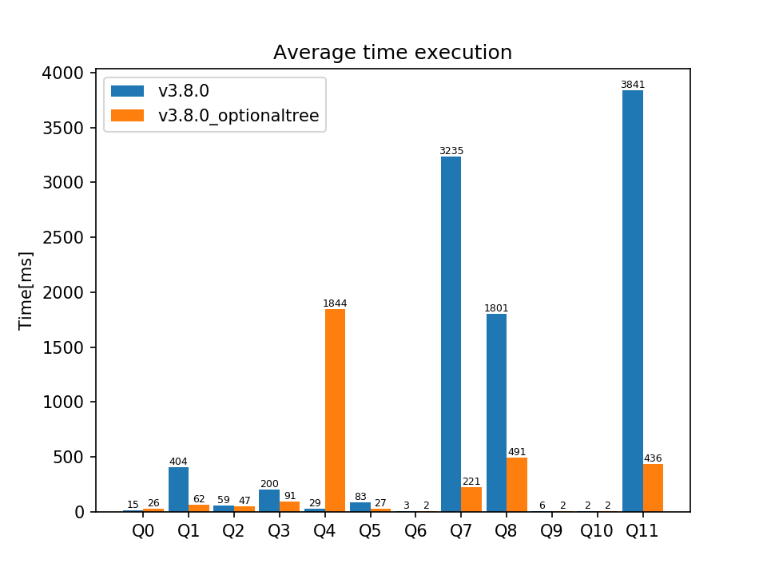

Se usó el leapfrog con el GAO según el orden en que se ve la variable (en cada repeticion se genera una permutación de triples aleatoria).   

  

## timeouts
7 timeouts en la Q7 para la ejecución normal.
  
## Q0:  
SELECT * WHERE {  
    ?x ?y ?z .  
}  
LIMIT 10000  
  
  
## Q1:  
SELECT * WHERE {  
    ?x ?y ?z .  
	?z ?y ?x  
}  
LIMIT 10000  
  
  
## Q2:  
SELECT * WHERE {  
    ?x ?y ?z .  
	?x ?u ?z  
}  
LIMIT 10000  
  
  
## Q3:  
SELECT * WHERE {  
    ?x ?y ?z .  
    ?z ?y ?u .  
    ?u ?y ?z  
}  
LIMIT 10000  
  
## Q4:  
SELECT * WHERE {  
    ?x <<http://www.w3.org/2004/02/skos/core#related>> ?y .  
    ?y <<http://www.w3.org/2004/02/skos/core#related>> ?z .  
    ?z <<http://www.w3.org/2004/02/skos/core#related>> ?u  
}  
LIMIT 10000  
  
## Q5:  
SELECT * WHERE {  
    ?x <<http://www.w3.org/1999/02/22-rdf-syntax-ns#type>> 	?y1 .  
    ?x <<http://www.w3.org/2000/01/rdf-schema#label>> 		?y2 .  
    ?x <<http://www.w3.org/2004/02/skos/core#narrower>> 		?y3 .  
    ?x <<http://www.w3.org/2004/02/skos/core#prefLabel>> 		?y4  
}  
LIMIT 10000  
  
## Q6:  
SELECT * WHERE {  
    ?x <<http://www.w3.org/2000/01/rdf-schema#isDefinedBy>> 	?y .  
    ?x <<http://www.w3.org/1999/02/22-rdf-syntax-ns#type>> 	?y1 .  
    ?x <<http://www.w3.org/2004/02/skos/core#scopeNote>> 		?y2 .  
    ?x <<http://www.w3.org/2004/02/skos/core#definition>> 	?y3 .  
    ?y <<http://purl.org/dc/terms/contributor>> 				?z1 .  
    ?y <<http://purl.org/dc/terms/creator>> 					?z2 .  
    ?y <<http://purl.org/dc/terms/title>>						?z3  
}  
LIMIT 10000  
  
## Q7:  
SELECT * WHERE {  
    ?x ?y ?z .  
    ?y ?u ?v .  
    ?u ?w ?z  
}  
LIMIT 10000  
  
## Q8:  
SELECT * WHERE {  
    ?x ?c ?y .  
    ?x ?c ?z .  
    ?y ?c ?z .  
    ?y ?c ?u .  
    ?z ?c ?u .  
    ?u ?c ?x  
}  
LIMIT 10000  
  
## Q9:  
SELECT * WHERE {  
    ?x <<http://www.w3.org/2002/07/owl#disjointWith>> 		?y .  
    ?x <<http://www.w3.org/2004/02/skos/core#definition>> 	?a1 .  
    ?x <<http://www.w3.org/2000/01/rdf-schema#label>> 		?a2 .  
    ?y <<http://www.w3.org/2000/01/rdf-schema#isDefinedBy>>   ?z .  
    ?y <<http://www.w3.org/1999/02/22-rdf-syntax-ns#type>> 	?a3 .  
    ?y <<http://www.w3.org/2004/02/skos/core#definition>> 	?a4 .  
    ?z <<http://purl.org/dc/terms/contributor>> 			    ?a5 .  
    ?z <<http://purl.org/dc/terms/creator>> 				    ?a6 .  
    ?z <<http://purl.org/dc/terms/title>> 					?a7  
}  
LIMIT 10000  
  
## Q10:  
SELECT * WHERE {  
    ?x <<http://www.w3.org/2002/07/owl#disjointWith>> 		?y .  
    ?x <<http://www.w3.org/2002/07/owl#disjointWith>> 		?z .  
    ?x <<http://www.w3.org/2000/01/rdf-schema#isDefinedBy>> 	?u .  
    ?y <<http://www.w3.org/2004/02/skos/core#definition>> 	?a1 .  
    ?y <<http://www.w3.org/2004/02/skos/core#example>> 		?a2 .  
    ?y <<http://www.w3.org/2004/02/skos/core#definition>> 	?a3 .  
    ?z <<http://www.w3.org/2004/02/skos/core#definition>> 	?a4 .  
    ?z <<http://www.w3.org/2004/02/skos/core#example>> 		?a5 .  
    ?z <<http://www.w3.org/2004/02/skos/core#scopeNote>> 		?a6 .  
    ?u <<http://purl.org/dc/terms/title>> 					?a7 .  
    ?u <<http://purl.org/dc/terms/creator>> 					?a8 .  
    ?u <<http://purl.org/dc/terms/description>> 				?a9  
}  
LIMIT 10000  
  
## Q11:  
SELECT * WHERE {  
    ?x ?y ?z .  
    ?y ?u ?v .  
    ?u ?w ?r .  
    ?w ?y ?s  
}  
LIMIT 10000  
  
